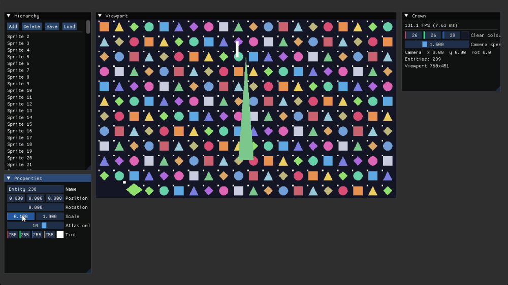

# Crown

A 2D game engine in C++, built from scratch on OpenGL. Windows only.



Hierarchy on the left, viewport in the middle, properties on the right. The scene
renders into a framebuffer rather than straight to the window, so it can live
inside a panel. Sprites are drawn from a texture atlas, and scenes save to plain
text.

## Building

Requires Visual Studio 2026 with the C++ desktop workload.

```
git clone --recursive https://github.com/KarnaTheGameDev/Crown.git
```

Already cloned without `--recursive`:

```
git submodule update --init --recursive
```

Then generate the projects and open the solution:

```
GenerateProject.bat
```

Set **Sandbox** as the startup project the first time; premake does not mark one.

Assets are found by walking up from the executable, so it does not matter whether
you launch from Visual Studio, from `bin/`, or by double-clicking.

## Dependencies

| | | |
|---|---|---|
| [GLFW](https://github.com/TheCherno/glfw) | window and input | submodule |
| [glm](https://github.com/g-truc/glm) | vector and matrix maths | submodule |
| [Dear ImGui](https://github.com/ocornut/imgui) | editor UI (docking branch) | submodule |
| [spdlog](https://github.com/gabime/spdlog) | logging | submodule |
| [glad](https://github.com/Dav1dde/glad) | OpenGL 4.6 core loader | vendored source |
| [stb_image](https://github.com/nothings/stb) | image loading | vendored header |

premake5 is committed under `vendor/bin/premake/`, so no separate download.

### Regenerating glad

glad is generated output, not a submodule, so there is no upstream to trace it
back to. To reproduce `Crown/vendor/Glad`:

```
python -m glad --api gl:core=4.6 --extensions="" c
```

Extensions are excluded deliberately: including all 623 takes the generated
source from 345 KB to 1.5 MB for entry points nothing calls. Add specific ones
to `--extensions` if something needs them.

## Controls

| | |
|---|---|
| `W` `A` `S` `D` | move the camera |
| `Q` `E` | rotate the camera |
| `Ctrl+S` | save the scene to `assets/scenes/scene.crown` |
| `Ctrl+O` | load it back |

Camera input is ignored while an ImGui widget has keyboard focus, so typing into
a field does not also drive the camera.

## Scene format

Scenes are line-oriented text, no serialisation library:

```
crown-scene 1
entity
name Sprite 0
pos -1.425 -0.825 0
rot 0
scale 0.09 0.09
cell 0
tint 1 1 1 1
```

Unknown keys are skipped, so a file written by a later build still loads what
this one understands. A higher version number in the header is rejected outright.
Loading parses into a temporary and only replaces the scene on success; saving
writes alongside the target and renames over it.

## What is deliberately not built

These are decisions, not gaps. Each one is cheap to add later and would be a
guess today:

- **No Renderer / RendererAPI abstraction.** One backend, no batching, no sort
  step. Three layers of indirection over `glDrawElements` would buy nothing.
- **No VertexArray / BufferLayout classes.** One mesh, one vertex layout.
- **No ECS.** `Entity` is a plain struct in a `std::vector`. At a few hundred
  sprites that beats a component store on both readability and cache behaviour.
- **No layer stack.** There are no layers.
- **No batching.** 240 draw calls at 144 FPS is not a measured problem. If it
  becomes one, instancing is about ten lines.

## Layout

```
Crown/src/Crown/          engine
  Renderer/               Shader, Texture2D, Framebuffer, OrthographicCamera
  Scene/                  Entity, SceneSerializer
  Events/                 event types and dispatcher
Crown/src/Platform/       Windows implementations
Sandbox/                  client application
assets/                   textures and scenes
```
